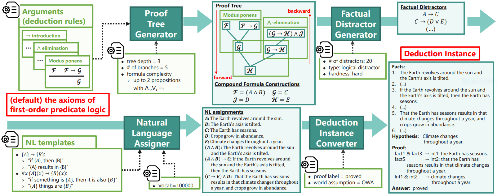

# FLD Generator


This repository includes the code for generating the FLD corpus.  

See [the entry-point repository](https://github.com/hitachi-nlp/FLD.git) about the whole FLD project.


## Releases (READ CAREFULLY to determine which branch suits you)
* **`NLP_2024_KOBE_BEEF`** branch (2024-01-24) 
    - Release at NLP (言語処理学会) 2024.
    - **Now capable of generating Japanese corpora (JFLD).**
    - Slight changes in the corpus schema.
    - **This branch and the generated corpora might not be compatible with older branches of related repositories.**
* **`main`** branch (2023-08-22)
    - Initial release at ICML 2023.
    - This is version 2.0 of FLD corpora. See the Appendix H of [our paper](https://arxiv.org/abs/2308.07336) for details.


## Installation
The code has been tested on Python 3.11.5.
```console
pip install -r ./requirements/requrements.txt
export PYTHONPATH=`pwd -P`:$PYTHONPATH
```


## Additional Resources Required
* For Japanese FLD
    ```console
    ./download_scripts/00.download_JFLD_resources.sh
    ```
* For knowledge FLD
    ```console
    ./download_scripts/00.download_knowledge_banks.sh
    ```


## How to generate FLD corpus
Use `./scripts/create_corpus.py`, which generates a corpus based on the design specified by the option values.
Note that creating corpora is computationally expensive; for instance, generating 30,000 examples may require approximately 500 CPU cores for 30 minutes."

* **FLD** (FLD.3):
    ```console
    python ./scripts/create_corpus.py \
        <output_dir> \
        <dataset_size> \
        --depth-range '[1, 3]' \
        --depth-distrib flat \
        --branch-extensions-range '[0, 5]' \
        --argument-config ./configs/arguments/axioms/ \
        --argument-config ./configs/arguments/references/ \
        --complex-formula-arguments-weight 0.5 \
        --quantifier-axiom-arguments-weight 0.2 \
        --quantifier-axiom universal_quantifier_elim \
        --quantifier-axiom universal_quantifier_intro \
        --quantifier-axiom existential_quantifier_intro \
        --quantifier-axiom existential_quantifier_elim  \
        --translation-lang eng \
        --translation-config ./configs/translations/eng/thing.v1/     \
        --distractor "mixture(negative_tree_double.simplified_formula.various_form)" \
        --distractors-range '[0, 20]'      \
        --num-workers 5 \
        --seed 0
    ```

* **FLD★** (FLD.4):
    ```console
    python ./scripts/create_corpus.py \
        <output_dir> \
        <dataset_size> \
        --depth-range '[1, 8]' \
        --depth-distrib flat \
        --branch-extensions-range '[0, 5]' \
        --argument-config ./configs/arguments/axioms/ \
        --argument-config ./configs/arguments/references/ \
        --complex-formula-arguments-weight 0.5 \
        --quantifier-axiom-arguments-weight 0.2 \
        --quantifier-axiom universal_quantifier_elim \
        --quantifier-axiom universal_quantifier_intro \
        --quantifier-axiom existential_quantifier_intro \
        --quantifier-axiom existential_quantifier_elim  \
        --translation-lang eng \
        --translation-config ./configs/translations/eng/thing.v1/     \
        --distractor "mixture(negative_tree_double.simplified_formula.various_form)" \
        --distractors-range '[0, 20]'      \
        --num-workers 5 \
        --seed 0
    ```

* **JFLD_BCCWJ (D1_minus)**
    ```console
    python ./scripts/create_corpus.py \
        <output_dir> \
        <dataset_size> \
        --depth-range '[1, 1]' \
        --depth-distrib flat \
        --branch-extensions-range '[0, 0]' \
        --argument-config ./configs/arguments/axioms/axiom.and_or.pred_arg.json \
        --argument-config ./configs/arguments/axioms/axiom.implication_intro.pred_arg.json \
        --argument-config ./configs/arguments/axioms/axiom.negation.pred_arg.json \
        --argument-config ./configs/arguments/axioms/axiom.pred_arg.json \
        --argument-config ./configs/arguments/references/reference.pred_arg.json \
        --complex-formula-arguments-weight 0.5 \
        --quantifier-axiom-arguments-weight 0.2 \
        --quantifier-axiom universal_quantifier_elim \
        --quantifier-axiom universal_quantifier_intro \
        --quantifier-axiom existential_quantifier_intro \
        --quantifier-axiom existential_quantifier_elim  \
        --translation-lang jpn \
        --translation-config thing.v1 \
        --translation-no-transitive-object    \
        --translation-vocab BCCWJ \
        --distractor "mixture(negative_tree_double.simplified_formula.various_form)" \
        --distractors-range '[0, 0]'      \
        --num-workers 5 \
        --seed 0
    ```

* **JFLD_BCCWJ (D1)**
    ```console
    python ./scripts/create_corpus.py \
        <output_dir> \
        <dataset_size> \
        --depth-range '[1, 1]' \
        --depth-distrib flat \
        --branch-extensions-range '[0, 0]' \
        --argument-config ./configs/arguments/axioms/axiom.and_or.pred_arg.json \
        --argument-config ./configs/arguments/axioms/axiom.implication_intro.pred_arg.json \
        --argument-config ./configs/arguments/axioms/axiom.negation.pred_arg.json \
        --argument-config ./configs/arguments/axioms/axiom.pred_arg.json \
        --argument-config ./configs/arguments/references/reference.pred_arg.json \
        --complex-formula-arguments-weight 0.5 \
        --quantifier-axiom-arguments-weight 0.2 \
        --quantifier-axiom universal_quantifier_elim \
        --quantifier-axiom universal_quantifier_intro \
        --quantifier-axiom existential_quantifier_intro \
        --quantifier-axiom existential_quantifier_elim  \
        --translation-lang jpn \
        --translation-config thing.v1 \
        --translation-no-transitive-object    \
        --translation-vocab BCCWJ \
        --distractor "mixture(negative_tree_double.simplified_formula.various_form)" \
        --distractors-range '[0, 20]'      \
        --num-workers 5 \
        --seed 0
    ```

* **JFLD_BCCWJ (D3)**
    ```console
    python ./scripts/create_corpus.py \
        <output_dir> \
        <dataset_size> \
        --depth-range '[1, 3]' \
        --depth-distrib flat \
        --branch-extensions-range '[0, 5]' \
        --argument-config ./configs/arguments/axioms/axiom.and_or.pred_arg.json \
        --argument-config ./configs/arguments/axioms/axiom.implication_intro.pred_arg.json \
        --argument-config ./configs/arguments/axioms/axiom.negation.pred_arg.json \
        --argument-config ./configs/arguments/axioms/axiom.pred_arg.json \
        --argument-config ./configs/arguments/references/reference.pred_arg.json \
        --complex-formula-arguments-weight 0.5 \
        --quantifier-axiom-arguments-weight 0.2 \
        --quantifier-axiom universal_quantifier_elim \
        --quantifier-axiom universal_quantifier_intro \
        --quantifier-axiom existential_quantifier_intro \
        --quantifier-axiom existential_quantifier_elim  \
        --translation-lang jpn \
        --translation-config thing.v1 \
        --translation-no-transitive-object    \
        --translation-vocab BCCWJ \
        --distractor "mixture(negative_tree_double.simplified_formula.various_form)" \
        --distractors-range '[0, 20]'      \
        --num-workers 5 \
        --seed 0
    ```

* **JFLD_BCCWJ (D8)**
    ```console
    python ./scripts/create_corpus.py \
        <output_dir> \
        <dataset_size> \
        --depth-range '[1, 8]' \
        --depth-distrib flat \
        --branch-extensions-range '[0, 5]' \
        --argument-config ./configs/arguments/axioms/axiom.and_or.pred_arg.json \
        --argument-config ./configs/arguments/axioms/axiom.implication_intro.pred_arg.json \
        --argument-config ./configs/arguments/axioms/axiom.negation.pred_arg.json \
        --argument-config ./configs/arguments/axioms/axiom.pred_arg.json \
        --argument-config ./configs/arguments/references/reference.pred_arg.json \
        --complex-formula-arguments-weight 0.5 \
        --quantifier-axiom-arguments-weight 0.2 \
        --quantifier-axiom universal_quantifier_elim \
        --quantifier-axiom universal_quantifier_intro \
        --quantifier-axiom existential_quantifier_intro \
        --quantifier-axiom existential_quantifier_elim  \
        --translation-lang jpn \
        --translation-config thing.v1 \
        --translation-no-transitive-object    \
        --translation-vocab BCCWJ \
        --distractor "mixture(negative_tree_double.simplified_formula.various_form)" \
        --distractors-range '[0, 20]'      \
        --num-workers 5 \
        --seed 0
    ```

* **JFLD_punipuni_monster**
    - The same as BCCWJ but swap the following options:
        ```console
        (...)
        --translation-config punipuni.v0 \
        --translation-vocab punipuni \
        (...)
        ```
